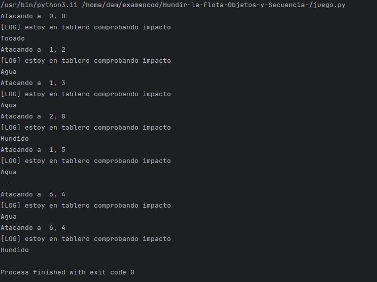

# Tarea y Examen 2av Hundir la flota 

## Autor

- Anxo Vázquez Lorenzo (Curso 1DAM)

# Funcionamiento Programa

Juego de Hundir la flota que manda disparos a un tablero con casillas, el usuario tiene que intentar Hundir todos los barcos posibles

# Captura del Funcionamiento

